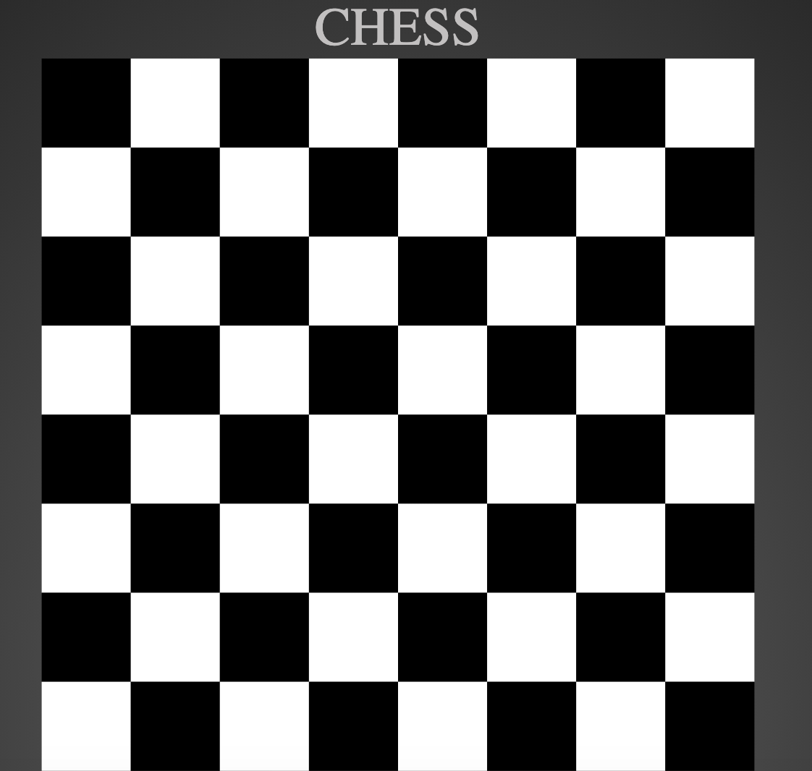

# Chess Board 

### mission
I wanted to use grid and CSS, with JS to they move a chess piece around on a board. 

I was impressed at how I could literate html div boats using JS... now I just need to use a controler or switch to move a piece around 

 

